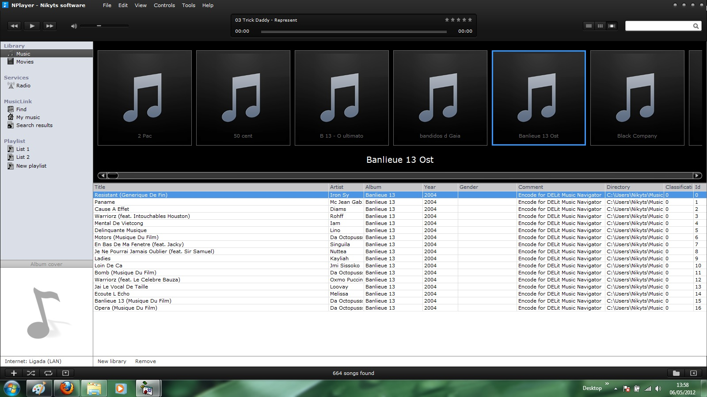



## NPlayer

### Description

Programme to play music and movies, Musiclink (search and listen to songs online), Radio, My other drive, app library.

NPlayer is a free license program, which allows it to be copied and distributed provided it complies with copyright and not the program is not modified without permission of the Nikyts software.

I hope you enjoy!

Web official of program: www.nplayer.comuv.com
 
### More Info
 

             |
---                |---
**Submitted On**   |2012-08-10 15:07:56
**By**             |[Nikyts](https://github.com/Planet-Source-Code/PSCIndex/blob/master/ByAuthor/nikyts.md)
**Level**          |Intermediate
**User Rating**    |4.7 (66 globes from 14 users)
**Compatibility**  |VB 6\.0, VB Script, ASP \(Active Server Pages\) 
**Category**       |[Sound/MP3](https://github.com/Planet-Source-Code/PSCIndex/blob/master/ByCategory/sound-mp3__1-45.md)
**World**          |[Visual Basic](https://github.com/Planet-Source-Code/PSCIndex/blob/master/ByWorld/visual-basic.md)
**Archive File**   |[NPlayer2226908102012\.zip](https://github.com/Planet-Source-Code/nikyts-nplayer__1-74295/archive/master.zip)

